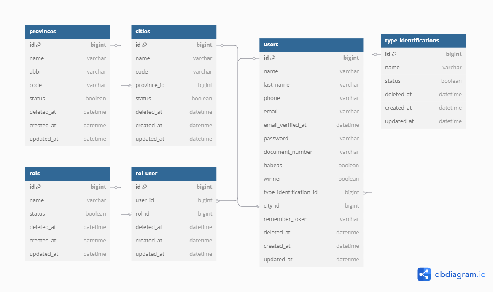

# Prueba Técnica - Inxait

Este proyecto ha sido desarrollado en **Laravel 12** como parte de una prueba técnica.

---

## ✅ Requisitos

Antes de comenzar, asegúrate de tener instalado lo siguiente:

- PHP 8.\*
- Composer
- Node.js v20 o superior
- XAMPP o Laragon
- MySQL o sistema de gestión de base de datos compatible

---

## 🚀 Instalación del proyecto

Sigue los siguientes pasos para ejecutar el proyecto en tu entorno local:

### 1. Clonar el repositorio

```bash
git clone https://github.com/crixus12cr/inxait.git
cd inxait
```
### 2. Instalar dependencias de PHP
```bash
composer install
```

### 3. Configurar el entorno
```bash
cp .env.example .env
```
Edita el archivo .env para configurar la conexión a tu base de datos local.

Luego, genera la clave de la aplicación:
```bash
php artisan key:generate
```
### 4. Instalar dependencias de Node.js
```bash
npm install
npm run dev
```
### 5. Ejecutar migraciones y seeders
Esto eliminará todas las tablas existentes, las recreará y llenará con datos de prueba:
```bash
php artisan migrate:fresh --seed
```
### 6. Iniciar el servidor de desarrollo
```bash
php artisan serve
```
Esto ejecutará el proyecto en:
```bash
http://127.0.0.1:8000
```

# 🌐 Acceso a la aplicación
Landing Page: http://127.0.0.1:8000
<br>
Panel de administración (login): http://127.0.0.1:8000/login

## Acceso Al Administrador
Correo: admin@admin.com
<br>
Contraseña: administrador

## Diagrama Entidad Relacion BD
<p align="center">
  
</p>
